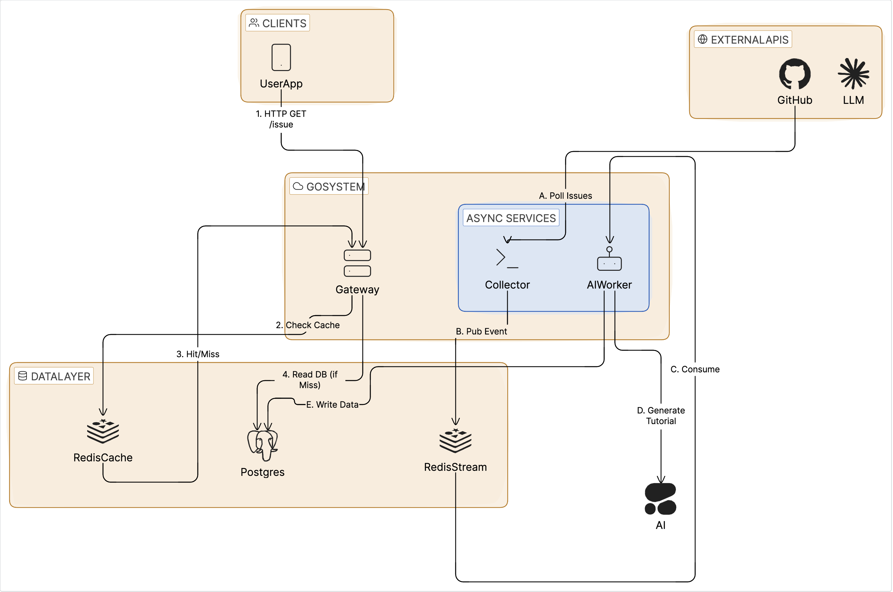
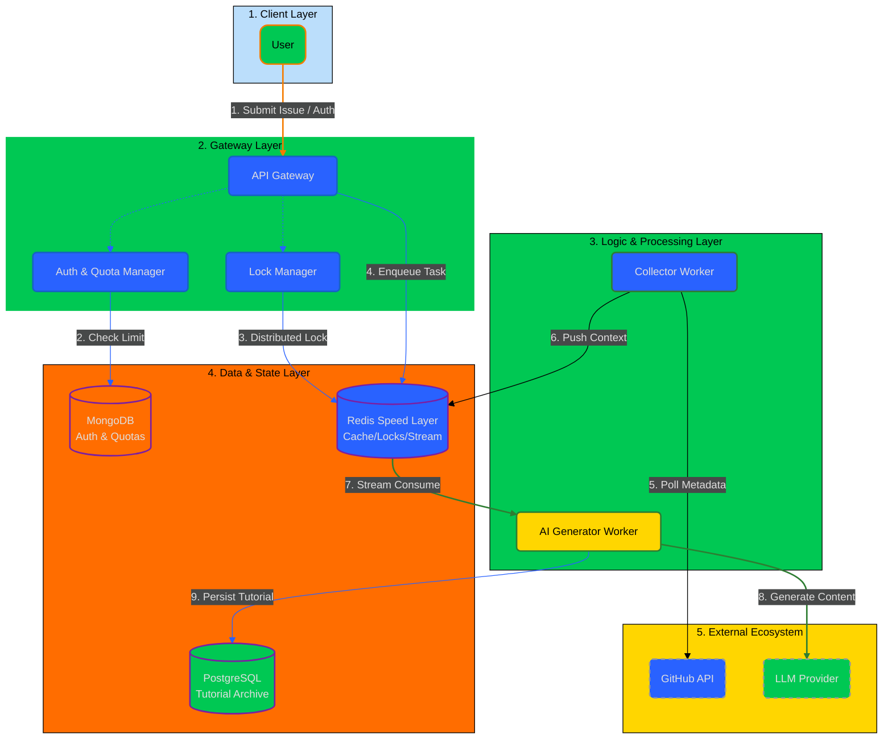
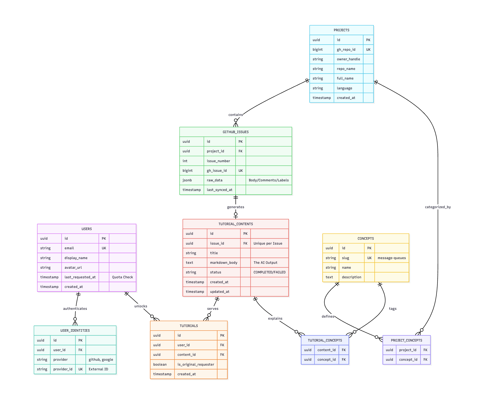

# IssueSight 🔭

> **Bridging the gap between "Good First Issues" and "Great First Contributions" via AI-driven mentorship.**

[](https://go.dev/)
[](https://redis.io/)
[](https://www.postgresql.org/)
[]()

---

## The Engineering Goal
**IssueSight** is a distributed, event-driven platform designed to solve a specific problem in the Open Source ecosystem: **Context Switching**.

Junior engineers often struggle to contribute not because they can't code, but because they lack the domain context of massive repositories. IssueSight ingests GitHub issues and uses LLMs to generate **"Context Bridges"** from breaking down complex tickets into junior-level prerequisites, architectural summaries, and implementation guides.

---

## System Architecture
The system follows a vertical **Microservices Layering** pattern in a monorepo structure. Traffic flows from the Next.js Frontend (Client) through the Go Gateway (Center) down to the Persistence Layer (Bottom).






### Data Flow Breakdown
1.  **Ingestion (The Write Path - Blue Lines):** A background `Collector` service polls GitHub and pushes raw events to a **Redis Stream**. This ensures that if the GitHub API is slow or rate-limited, it does not block the rest of the application.
2.  **Processing (The Worker):** The `AI Worker` consumes the stream, utilizing `OpenAI` to analyze the code complexity. It determines if an issue is truly "Junior Friendly" or if it requires advanced knowledge.
3.  **Serving (The Read Path - Orange Lines):** The `API Gateway` serves the frontend. It implements a **Cache-Aside** strategy: popular issues are served from Redis KV memory (<5ms), while the database is only hit on cache misses.

---


## Key Technical Decisions

### 📊 Data Model

The database schema follows a normalized relational design with PostgreSQL as the primary data store. The ERD below illustrates the core entities and their relationships:



### Core Entities

- **PROJECTS**: Repositories tracked by IssueSight, storing GitHub repository metadata and language information
- **GITHUB_ISSUES**: Issues fetched from GitHub, linked to projects with raw JSONB data for flexibility
- **TUTORIAL_CONTENTS**: AI-generated context bridges (one per issue), stored as markdown with status tracking
- **USERS**: User accounts with quota management and last request tracking
- **USER_IDENTITIES**: OAuth provider mappings (GitHub, Google, etc.) for multi-provider authentication
- **TUTORIALS**: User-tutorial relationships tracking who unlocked which tutorials
- **CONCEPTS**: Reusable concept definitions (e.g., "message-queues", "authentication") that can be tagged to projects and tutorials

### Key Relationships

- **One-to-Many**: Projects → Issues, Users → Tutorials, Users → Identities
- **One-to-One**: Issue → Tutorial Content (unique constraint ensures one tutorial per issue)
- **Many-to-Many**: Tutorials ↔ Concepts (via `TUTORIAL_CONCEPTS`), Projects ↔ Concepts (via `PROJECT_CONCEPTS`)

This design enables efficient querying, supports concept-based discovery, and maintains data integrity while allowing flexible JSONB storage for volatile GitHub API responses.

---

## 🛠️ Key Technical Decisions
>>>>>>> Stashed changes

### Why Redis Streams?
I chose Redis Streams over a simple cron job to **decouple** the fetching logic from the processing logic. This allows the system to scale independently—if issue volume spikes, I can simply spin up more `AI Worker` replicas without changing the Collector code.

### Why PostgreSQL + JSONB?
GitHub's API response is large and volatile. Instead of strictly normalizing every field, I utilize a **Hybrid Schema**:
* **Structured Columns:** `id`, `status`, `difficulty` (Indexed for fast lookups/filtering).
* **JSONB:** `raw_github_payload` (Stored as-is for future flexibility without schema migrations).

### Why Go?
Go was selected for its native concurrency primitives (`goroutines`), which are essential for handling multiple HTTP requests and background stream processing with minimal memory footprint compared to Node.js or Python.

---

## Tech Stack

| Component | Technology | Reasoning |
| :--- | :--- | :--- |
| **Frontend** | Next.js 14 (TypeScript, App Router) | Modern React framework with server-side rendering. |
| **Backend** | Golang (Gin/Standard Lib) | Strong typing, high performance, native concurrency. |
| **Database** | PostgreSQL 16 | ACID compliance with JSONB support. |
| **Message Broker** | Redis Streams | Lightweight, low-latency event buffering. |
| **Caching** | Redis KV | High-speed read access for API endpoints. |
| **AI Layer** | OpenAI GPT-4o | Context analysis and prerequisite generation. |
| **Infrastructure** | Docker Compose | Reproducible local development environment. |

---

## Project Structure

```
issuesight/
├── web/                    # Next.js Frontend Service
├── backend/                # Go Microservices
│   ├── gateway/           # API Gateway
│   ├── collector/         # GitHub Issue Collector
│   └── ai-processor/      # AI Content Generator
├── internal/              # Shared Go Packages
│   ├── platform/         # Platform utilities (db, stream, lock)
│   └── domain/           # Shared domain types
└── deployments/           # Docker Compose & Environment Configs
```


